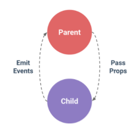
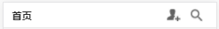
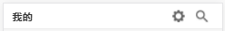
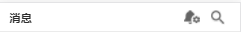

# Vue父子组件通信
<div style="text-align:center">
  
</div>
上图是官方提供的父子组件通信的示例图 <br />

父组件通过自定义属性(:prop)向子组件传递消息，子组件通过事件($emit+$on)向父组件传递消息<br />

以简书的app为例：<br />

<div style="text-align:center">
  
</div>
<div style="text-align:center">
  
</div>
<div style="text-align:center">
  
</div>
几个底部导航按钮的头部布局相同，只有左侧文字不同，右侧图标和路由不同，所以将其提取为公共header组件（子组件）:

##  header组件（子组件）代码

```
<div class="home-header" @click="test">
  <div class="home-header-left">{{headerText}}</div>
  <div class="home-header-right">
    <router-link :to="'/'+handlerUrl">
      <div class="home-heaader-function">
        <span class="header-feature">
          
        </span>
      </div>
    </router-link>
    <router-link to="/search">
      <div class="home-heaader-function">
        <span class="header-search">
          
        </span>
      </div>
    </router-link>
  </div>
</div>
```
```
.home-header{height:90px;width:750px;box-sizing: border-box;padding:0 30px;font-size: 35px;position: fixed;top:0;left:50%;margin-left: -375px;background-color: white;z-index: 10;
border-bottom: 1px solid #ccc;color: #2c2c2c;font-weight: 600}
.home-header-left{height:90px;width:100px;text-align: left;line-height: 90px;float: left;}
.home-header-right{height:90px;width: 160px;float: right;}
.home-heaader-function{height:90px;width:80px;float:left;text-align: center;overflow: hidden;}
.header-search,.header-feature{height: 43px;width: auto;display: inline-block;margin-top: 23px}
.header-search img,.header-feature img{height: 43px;width: 100%}
.home-search{width:750px;background-color: red;position: fixed;top:0;left: 0;bottom: 90px;}
```
```
export default{
  props:["headerText","handlerImg","handlerUrl"],
  methods:{
    test:function(){
      this.$emit('fafn');
    }
  }
}
```


## home组件（父组件代码）

```
<div>
    <home-header :header-text="headText" :handler-url="handlerUrl" :handlerImg="handlerImg" @fafn="fafn"></home-header>
    <home-content></home-content>
</div>
```
```
import homeHeader from "../common/header.vue"
import homeContent from "./content.vue"
import { mapMutations } from 'vuex'
export default{
  data(){
    return {
      headText:"首页",
      handlerUrl:"recommendFollow",
      handlerImg:"../../images/header/home.png"
    }
  },
  components:{
    homeHeader:homeHeader,
    homeContent:homeContent
  },
  beforeRouteLeave :function(to,from,next){
    var top = document.querySelector(".home-main").scrollTop;
    this.RECORD_SCROLL({name:"home",height:top});
    next();
  },
  mounted:function(){
    document.querySelector(".home-main").scrollTop = this.scroll;
  },
  methods:{
    ...mapMutations(["RECORD_SCROLL"]),
    fafn:function(){
      console.log(1);
      this.headText = "子组件";
    }
  },
  computed:{
    scroll(){
      return this.$store.state.homeScroll
    }
  }
}
```
定义子组件的过程就好像函数的封装，子组件就好像是我们定义一个有参数的函数，在实际使用时传入特定的内容就能产生我们想要的结果。<br />

子组件中动态内容需要在js中通过props来声明,然后在html模板中正常使用即可(通过{{}}或者:prop="")<br />

## 父组件向子组件通信

我们再子组件(header组件中)通过props定义了3个属性headerText、handlerImg、handlerUrl，如果要在父组件中使用该子组件，则要有以下过程：<br />

### 子组件实现过程

1.在js中通过props来定义属性，如headerText、handlerImg、handlerUrl

```
props:["headerText","handlerImg","handlerUrl"]
```

2.在html模板中绑定props定义的属性


### 父组件实现过程

1.在父组件中导入该子组件

```
import homeHeader from "../common/header.vue"
```

2.注册该子组件

```
components:{
  homeHeader:homeHeader,
  homeContent:homeContent
},
```

3.在html模板中使用该子组件并传入相应的值

```
<homeHeader :headerText="headText" :handlerUrl="handlerUrl" :handlerImg="handlerImg" @fafn="fafn"></homeHeader>
```
homeHeader组件中的:headerText、:handlerUrl、:handlerImg  要和子组件中的props里面定义的值保持一致(headerText和header-text是一样的)

## 子组件向父组件通信

子组件向父组件通信需要通过事件的方式来实现，基本步骤如下：<br />

### 在子组件中

1.在子组件js中定义事件处理函数，在事件处理函数中通过$emit来触发在父组件中为子组件绑定的自定义事件

```
methods:{
  test:function(){
    this.$emit('fafn');
  }
}
```

2.在子组件html模板中绑定事件

```
<div class="home-header" @click="test"></div>
```

### 在父组件中

1.在父组件js中定义一个处理函数

```
handler:function(){
  console.log(1);
  this.headText = "组件";
}
```

2.在注册的子组件实例中通过v-on(@)绑定一个自定义事件，该自定义事件的处理函数为步骤1定义的处理函数

```
<homeHeader :headerText="headText" :handlerUrl="handlerUrl" :handlerImg="handlerImg" @fafn="handler"></homeHeader>
```


